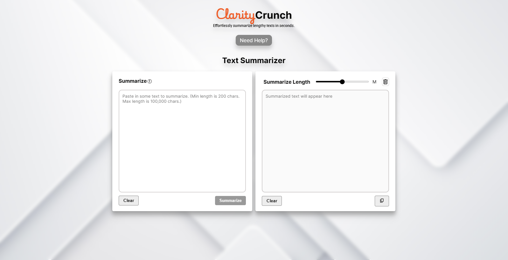

# <span style="color:">Clarity</span>Crunch


Welcome to **ClarityCrunch**, the web-based AI text summarizer that leverages the power of Facebook's BART-large-CNN model, provided through Hugging Face's serverless infrastructure, and built with Express.js for the backend.

## Features

- **Text Summarization**: Utilizes the cutting-edge BART-large-CNN model to provide concise summaries of your text.
- **Serverless Architecture**: Powered by Hugging Face's serverless platform for scalable and efficient AI model deployment.
- **Express Backend**: Fast and lightweight web server using Express.js, ensuring quick responses and a seamless user experience.

## Getting Started

To get started with **ClarityCrunch**, follow these steps:

1. **Clone the Repository**

```bash
git clone https://github.com/dineshsutihar/ClarityCrunch.git

cd ClarityCrunch
```

2. **Install Dependencies**

```bash
npm install
```

3. **Start the Server**

```bash
npm start
```

4. **Open the Web App**

Navigate to `http://localhost:3000` in your web browser to access **ClarityCrunch**.

## Usage

To generate a summary, simply paste your text into the input field and click the **Summarize** button. The summary will be displayed below the input field.
